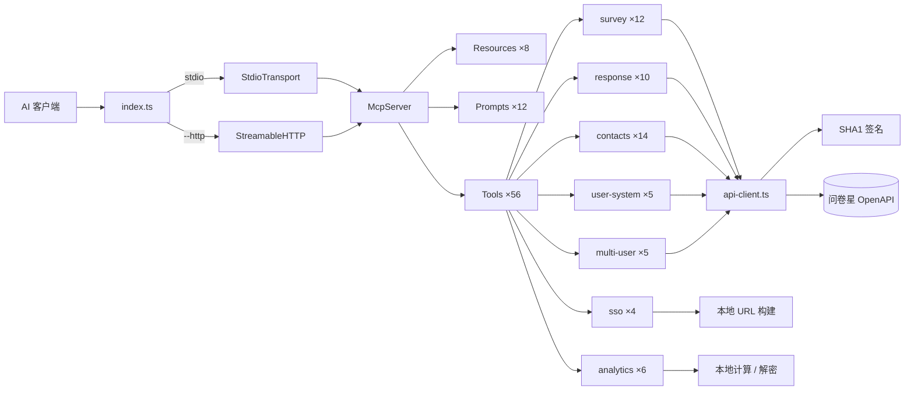

# WJX MCP Server

> 问卷星 MCP Server — 通过 [Model Context Protocol](https://modelcontextprotocol.io/) 将[问卷星](https://www.wjx.cn) OpenAPI 完整暴露给 AI 客户端。

[](https://www.npmjs.com/package/wjx-mcp-server)
[](LICENSE)
[](https://nodejs.org/)

通过 Claude、Cursor 或任何 MCP 兼容的 AI 客户端，以自然语言创建、管理和分析问卷。服务器封装了问卷星 OpenAPI，提供 **56 个 Tools**、**8 个 Resources** 和 **12 个 Prompts**。

---

## 功能特性

### 7 大模块 · 56 个 Tools

| 模块 | 工具数 | 说明 |
|------|:------:|------|
| **Survey** 问卷管理 | 12 | 创建、查询、列表、状态变更、设置读写、删除、题目标签、回收站、文本创建、预览 |
| **Response** 答卷数据 | 10 | 查询、实时查询、下载、统计报告、代填提交、文件链接、中奖者、改分、360° 报告、清空 |
| **Contacts** 通讯录 | 14 | 成员管理、管理员管理、部门管理、标签管理 |
| **SSO** 免登录 | 4 | 生成子账号 / 用户系统 / 合作伙伴 / 问卷创建编辑的 SSO 链接 |
| **User System** 用户体系 | 5 | 参与者增删改、绑定查询、分配查询 |
| **Multi-User** 多用户管理 | 5 | 子账号增删改恢复、子账号列表 |
| **Analytics** 本地分析 | 6 | 解码答卷、NPS 计算、CSAT 计算、异常检测、指标对比、推送解密 |

### 8 个 MCP Resources

AI 客户端可直接读取的参考数据：`survey-types`、`question-types`、`survey-statuses`、`analysis-methods`、`response-format`、`user-roles`、`push-format`、`dsl-syntax`。

### 12 个 MCP Prompts

预置工作流模板：`design-survey`、`analyze-results`、`create-nps-survey`、`configure-webhook`、`nps-analysis`、`csat-analysis`、`cross-tabulation`、`sentiment-analysis`、`survey-health-check`、`comparative-analysis`、`create-survey-by-text`、`batch-export`。

### 生产级特性

- **请求签名** — SHA1 签名 + 30 秒时间窗口，每次请求自动计算
- **TraceID** — 每请求生成 32 位 GUID，便于调试与追踪
- **自动重试** — 读操作遇 5xx/429 自动重试（指数退避，最多 2 次）；写操作不重试
- **超时控制** — 默认 15 秒，可按请求配置
- **双传输模式** — stdio（默认）+ Streamable HTTP（Bearer token 认证）
- **零额外依赖** — 运行时仅需 `@modelcontextprotocol/sdk` 和 `zod`

---

## 模块总览



---

## 快速开始

> 目标：5 分钟内完成首次运行。

### 前置条件

- **Node.js >= 20**
- **问卷星 OpenAPI API Key**

#### 获取 API 凭据

1. 登录[问卷星控制台](https://www.wjx.cn)
2. 进入 **账号设置 → API自动登录** 或联系客户经理开通 OpenAPI 权限
3. 获取 API Key（一串字母数字组成的密钥）

### 安装与构建

```bash
git clone <your-repo-url>
cd wjx-ai-kit/wjx-mcp-server
npm install
npm run build
```

### 配置

```bash
cp .env.example .env
```

编辑 `.env`，填入你的凭据：

```dotenv
WJX_API_KEY=your_api_key
```

### 启动（stdio 模式）

```bash
npm start
```

### 启动（HTTP 模式）

适用于远程部署或服务化场景：

```bash
# 通过 npm script
npm run start:http

# 或通过环境变量
MCP_TRANSPORT=http PORT=3000 MCP_AUTH_TOKEN=my-secret node dist/index.js
```

---

## 集成配置

### Claude Desktop

编辑 Claude Desktop 配置文件（macOS: `~/Library/Application Support/Claude/claude_desktop_config.json`）：

```json
{
  "mcpServers": {
    "wjx": {
      "command": "node",
      "args": ["./wjx-mcp-server/dist/index.js"],
      "env": {
        "WJX_API_KEY": "your_api_key"
      }
    }
  }
}
```

> 将 `args` 中的路径替换为你本地 `dist/index.js` 的实际路径。

### Claude Code

```bash
claude mcp add wjx -- node ./wjx-mcp-server/dist/index.js
```

### Cursor

在项目根目录创建或编辑 `.cursor/mcp.json`：

```json
{
  "mcpServers": {
    "wjx": {
      "command": "node",
      "args": ["./wjx-mcp-server/dist/index.js"],
      "env": {
        "WJX_API_KEY": "your_api_key"
      }
    }
  }
}
```

---

## 配置项说明

| 环境变量 | 必填 | 默认值 | 说明 |
|----------|:----:|--------|------|
| `WJX_API_KEY` | **是** | — | 问卷星 OpenAPI API Key |
| `WJX_CORP_ID` | 否 | — | 企业通讯录 ID（通讯录相关操作需要） |
| `WJX_BASE_URL` | 否 | `https://www.wjx.cn` | 自定义 API 基础域名 |
| `MCP_TRANSPORT` | 否 | `stdio` | 设为 `http` 启用 HTTP 传输 |
| `PORT` | 否 | `3000` | HTTP 模式监听端口 |
| `MCP_AUTH_TOKEN` | 否 | — | HTTP 模式的 Bearer token 认证 |
| `MCP_SESSION` | 否 | `stateful` | 设为 `stateless` 禁用会话跟踪 |

### API / SSO 地址配置

所有工具调用的 URL 均可通过环境变量覆盖，方便切换测试环境或私有化部署。

只需设置 `WJX_BASE_URL` 即可一键切换所有 URL 的基础域名；也可单独覆盖某个地址：

| 环境变量 | 默认值 | 说明 |
|----------|--------|------|
| `WJX_BASE_URL` | `https://www.wjx.cn` | 所有 URL 的基础域名，其余 URL 默认从此派生 |
| `WJX_API_URL` | `{BASE}/openapi/default.aspx` | 问卷/答卷等通用 API 地址 |
| `WJX_USER_SYSTEM_API_URL` | `{BASE}/openapi/usersystem.aspx` | 用户体系 API 地址 |
| `WJX_SUBUSER_API_URL` | `{BASE}/openapi/subuser.aspx` | 子账号管理 API 地址 |
| `WJX_CONTACTS_API_URL` | `{BASE}/openapi/contacts.aspx` | 通讯录 API 地址 |
| `WJX_SSO_SUBACCOUNT_URL` | `{BASE}/zunxiang/login.aspx` | 子账号 SSO 登录地址 |
| `WJX_SSO_USER_SYSTEM_URL` | `{BASE}/user/loginform.aspx` | 用户体系 SSO 登录地址 |
| `WJX_SSO_PARTNER_URL` | `{BASE}/partner/login.aspx` | 合作伙伴 SSO 登录地址 |
| `WJX_SURVEY_CREATE_URL` | `{BASE}/newwjx/mysojump/createblankNew.aspx` | 问卷创建页地址 |
| `WJX_SURVEY_EDIT_URL` | `{BASE}/newwjx/design/editquestionnaire.aspx` | 问卷编辑页地址 |

> 表中 `{BASE}` 代表 `WJX_BASE_URL` 的值。优先级：**独立环境变量 > WJX_BASE_URL + 路径 > 硬编码默认值**。

示例 — 切换到测试环境：

```dotenv
WJX_BASE_URL=https://test.wjx.cn
```

服务器内置 `.env` 加载器，无需额外安装 `dotenv`。

---

## HTTP 模式

| 端点 | 方法 | 说明 |
|------|------|------|
| `/mcp` | POST | MCP 消息端点（Streamable HTTP / SSE） |
| `/health` | GET | 健康检查，返回 `{ status: "ok" }` |

设置 `MCP_AUTH_TOKEN` 后，`/mcp` 端点要求 `Authorization: Bearer <token>` 请求头；`/health` 端点始终公开。

---

## 项目结构

```
wjx-mcp-server/
├── src/
│   ├── index.ts                  # 入口：加载 .env、选择传输模式
│   ├── server.ts                 # createServer() — 注册模块
│   ├── helpers.ts                # toolResult() / toolError() 工具函数
│   ├── core/
│   │   ├── api-client.ts         # callWjxApi() — 重试、超时、签名
│   │   ├── sign.ts               # SHA1 排序签名
│   │   ├── constants.ts          # Action codes、API URL、默认值
│   │   └── types.ts              # 共享类型定义
│   ├── modules/
│   │   ├── survey/               # 问卷管理（12 tools）
│   │   ├── response/             # 答卷数据（10 tools）
│   │   ├── contacts/             # 通讯录（14 tools）
│   │   ├── sso/                  # 免登录 URL（4 tools）
│   │   ├── user-system/          # 用户体系（5 tools）
│   │   ├── multi-user/           # 多用户管理（5 tools）
│   │   └── analytics/            # 本地分析（6 tools）
│   ├── resources/                # 8 个 MCP Resources
│   ├── prompts/                  # 12 个 MCP Prompts
│   └── transports/http.ts        # Streamable HTTP 传输
├── __tests__/                    # 单元测试（node:test）
├── tests/                        # 集成测试
├── docs/
│   ├── architecture.md           # 架构设计文档
│   └── wjx-openapi-spec.md      # 问卷星 OpenAPI 参考
├── .env.example                  # 环境变量模板
├── CHANGELOG.md                  # 版本历史
├── LICENSE                       # MIT License
├── package.json
└── tsconfig.json
```

---

## 测试

```bash
# 全部测试（单元 + 集成）
npm test

# 仅单元测试
npm run test:unit

# 仅集成测试
npm run test:integration
```

测试使用 Node.js 内置测试运行器（`node:test`），无需额外测试框架。

---

## 开发

```bash
npm install          # 安装依赖
npm run build        # 编译 TypeScript
npm test             # 运行测试
npm run clean        # 清理 dist/
```

---

## 贡献

欢迎贡献！请参阅 [CONTRIBUTING.md](CONTRIBUTING.md) 了解贡献指南。

## 文档

- [架构设计](docs/architecture.md) — 详细架构说明
- [更新日志](CHANGELOG.md) — 版本历史
- [问卷星 OpenAPI 参考](docs/wjx-openapi-spec.md) — API 规范文档

## 许可证

[MIT](LICENSE)
