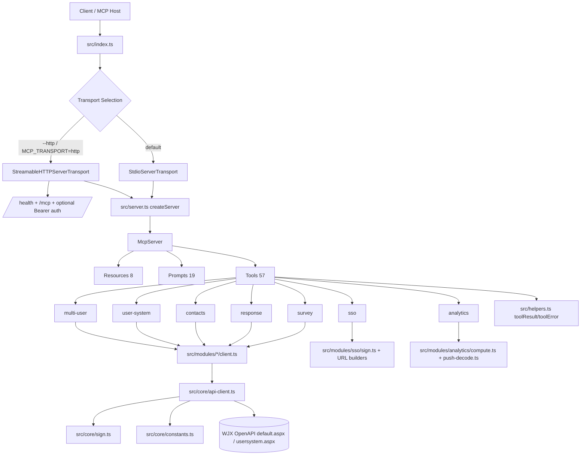

# wjx-mcp-server 架构设计

> 版本基线：`v0.1.4`
> 技术栈：Node.js `>=20`、TypeScript、`@modelcontextprotocol/sdk`、Zod

## 1. 概述

`wjx-mcp-server` 是一个围绕问卷星 OpenAPI 构建的 MCP Server。它把问卷管理、答卷查询、通讯录/用户体系管理、SSO 快速集成，以及本地分析能力统一暴露为 MCP 的三类原语：

- Tools：57 个
- Resources：8 个
- Prompts：19 个

整体设计遵循”入口层选择传输、MCP Server 统一注册能力、模块层封装业务、核心层处理签名/重试/超时”的分层思路。57 个 tools 中，`survey`/`response`/`contacts`/`user-system`/`multi-user` 主要访问问卷星远程接口，`sso` 与 `analytics` 则以内存计算和 URL 组装为主，不依赖远程 OpenAPI。

## 2. 整体架构



## 3. 启动流程

### 3.1 入口层

入口位于 `src/index.ts`，负责三件事：

1. 从包根目录加载可选 `.env` 文件。
2. 通过 `--http` 或 `MCP_TRANSPORT` 选择传输方式。
3. 调用 `createServer()` 构造 `McpServer`，并连接对应 transport。

默认模式是 `stdio`，用于 MCP 标准本地集成；HTTP 模式主要用于远程或服务化部署。

### 3.2 关闭流程

两种 transport 都在 `SIGINT` / `SIGTERM` 时触发关闭：

- HTTP 模式先关闭 Node HTTP server，再关闭 `McpServer`
- stdio 模式直接关闭 `McpServer`

这使 server 同时适配 CLI 生命周期和守护进程生命周期。

## 4. MCP Server 层

`src/server.ts` 是能力装配中心。`createServer()` 创建一个带完整 capabilities 的 `McpServer`：

- `tools`
- `resources`
- `prompts`

随后按固定顺序注册：

1. `registerResources(server)`
2. `registerPrompts(server)`
3. 七个业务模块的 `register*Tools(server)`

这种设计把“能力发现”和“业务实现”解耦，新增模块只需要补一个注册入口，不需要修改 transport 层。所有 tool handler 最终都通过 `src/helpers.ts` 中的 `toolResult()` / `toolError()` 统一返回 MCP 文本结果。

## 5. 模块层设计

### 5.1 模块总览

| 模块 | Tool 数量 | 主要职责 | 核心 API / 入口 |
| --- | ---: | --- | --- |
| `survey` | 12 | 问卷 CRUD、设置读写、标签、回收站、文本创建、文件上传 | `createSurvey()`、`createSurveyByText()`、`getSurvey()`、`updateSurveySettings()`、`clearRecycleBin()` |
| `response` | 10 | 答卷查询、下载、报告、提交、修改、清空 | `queryResponses()`、`downloadResponses()`、`getReport()`、`submitResponse()` |
| `contacts` | 14 | 通讯录成员、管理员、部门、标签管理 | `queryContacts()`、`addContacts()`、`listDepartments()`、`listTags()` |
| `sso` | 5 | 子账号 SSO、用户体系 SSO、代理商 SSO、问卷创建/编辑/预览链接 | `buildSsoSubaccountUrl()`、`buildSsoUserSystemUrl()`、`buildSsoPartnerUrl()`、`buildSurveyUrl()`、`buildPreviewUrl()` |
| `user-system` | 6 | 参与者管理、活动绑定、问卷绑定查询、用户关联问卷查询 | `addParticipants()`、`bindActivity()`、`querySurveyBinding()`、`queryUserSurveys()` |
| `multi-user` | 5 | 子账号创建、修改、删除、恢复、查询 | `addSubAccount()`、`modifySubAccount()`、`querySubAccounts()` |
| `analytics` | 5 | 答卷解码、NPS/CSAT、本地异常检测、指标对比 | `decodeResponses()`、`calculateNps()`、`calculateCsat()`、`detectAnomalies()`、`compareMetrics()` |

表内 Tool 数量直接对应各 `src/modules/*/tools.ts` 中 `server.registerTool()` 的出现次数，总计 `12 + 10 + 14 + 5 + 6 + 5 + 5 = 57`。

### 5.2 survey 模块

`survey` 模块覆盖问卷生命周期管理：

- `create_survey`
- `get_survey`
- `list_surveys`
- `update_survey_status`
- `get_survey_settings`
- `update_survey_settings`
- `delete_survey`
- `get_question_tags`
- `get_tag_details`
- `clear_recycle_bin`

特点：

- `createSurvey()` 在调用前校验 `questions` 是否为合法 JSON 数组。
- `buildCreateSurveyParams()` 作为测试辅助函数，可验证签名前参数结构。
- 设置更新工具要求至少传入一个设置块，避免空写请求。

### 5.3 response 模块

`response` 模块覆盖数据回收与报表：

- `query_responses`
- `query_responses_realtime`
- `download_responses`
- `get_report`
- `submit_response`
- `get_winners`
- `modify_response`
- `get_360_report`
- `clear_responses`

特点：

- 同时支持分页查询与实时队列式拉取。
- `download_responses` 兼容同步下载和 `taskid` 轮询两种模式。
- `query_responses_realtime`、`submit_response`、`modify_response`、`get_360_report`、`clear_responses` 等操作显式关闭自动重试，避免副作用请求被重复执行。

### 5.4 contacts 模块

`contacts` 模块负责企业通讯录域：

- 联系人查询、批量添加、批量管理
- 管理员增删恢复
- 部门查询、创建、修改、删除
- 标签查询、创建、修改、删除

这是工具数最多的模块，说明服务端设计优先把通讯录对象拆成稳定的细粒度操作，而不是把复杂变更塞进单一通用接口。

### 5.5 sso 模块

`sso` 模块是本地 URL 生成器，不走问卷星 OpenAPI：

- `sso_subaccount_url`
- `sso_user_system_url`
- `sso_partner_url`
- `build_survey_url`

其中前三者依赖本地 SHA1 签名，最后一个按规则拼接创建/编辑问卷链接。这一层与普通 OpenAPI 最大不同点是：签名使用“按参数业务顺序拼接值”，不是按 key 排序。

### 5.6 user-system 模块

`user-system` 模块连接问卷星的用户体系接口：

- `add_participants`
- `modify_participants`
- `delete_participants`
- `query_survey_binding`
- `query_user_surveys`

它通过 `callWjxUserSystemApi()` 访问独立的 `usersystem.aspx` 端点，而不是默认的 `default.aspx`。

### 5.7 multi-user 模块

`multi-user` 模块针对主账号下的子账号体系：

- `add_sub_account`
- `modify_sub_account`
- `delete_sub_account`
- `restore_sub_account`
- `query_sub_accounts`

设计上和 `contacts`、`user-system` 一致，继续复用核心层签名、超时和重试策略。

### 5.8 analytics 模块

`analytics` 模块完全本地执行，不依赖远程 API：

- `decode_responses`
- `calculate_nps`
- `calculate_csat`
- `detect_anomalies`
- `compare_metrics`
- `decode_push_payload`

它提供了面向 AI Agent 的二次处理能力：

- 将 `submitdata` 字符串解码为结构化答案
- 在本地计算 NPS / CSAT
- 基于答卷时长、答案一致性、IP+内容重复做异常检测
- 解密推送密文并可选校验签名

这让 server 不只是“API 包装器”，而是“API + 分析工具箱”的组合。

## 6. 核心层设计

### 6.1 常量与类型

`src/core/constants.ts` 维护：

- 默认 API 地址
- `Action` 编码表
- 超时与重试默认值

`src/core/types.ts` 定义：

- 凭证结构
- WJX 成功/失败响应联合类型
- 可注入 `fetch` 接口
- 请求选项和可签名参数类型

### 6.2 API Client

`src/core/api-client.ts` 是远程调用总入口，承担：

1. 读取凭据中的 `WJX_API_KEY`
2. 生成 Unix 时间戳
3. 生成 32 位无连字符 `traceid`
4. 为请求附加 `appid`、`ts`、`traceid`
5. 调用签名函数生成 `sign`
6. 通过 `fetch` 发起 POST JSON 请求
7. 处理超时、重试、响应解析和错误归一化

关键设计点：

- `callWjxApi()` 默认访问 `default.aspx`；`callWjxUserSystemApi()` 则复用同一套逻辑切到 `usersystem.aspx`。
- `traceid` 参与签名，但不会进入 POST body，而是放在 query string 中。
- 重试采用指数退避并加入随机抖动。
- 重试前刷新时间戳，因为问卷星签名窗口只有 30 秒。
- 只有 `429` 和 `5xx` 属于可重试 HTTP 状态。
- 网络错误和超时可重试；业务失败响应不会自动重试。
- `fetchImpl`、`timestamp`、`credentials` 都可注入，方便单元测试和协议级验证。

### 6.3 通用签名算法

`src/core/sign.ts` 实现问卷星 OpenAPI 的标准签名：

1. 排除 `sign` 字段
2. 按 key ASCII 升序排序
3. 取每个非空 value 按顺序拼接
4. 在末尾追加 `appKey`
5. 对拼接串做 SHA1 并输出小写十六进制

这部分由 `withSignature()` 封装，供所有远程 API 模块复用。

### 6.4 SSO 签名算法

`src/modules/sso/sign.ts` 单独实现 SSO 签名：

- 不按 key 排序
- 按接口要求的业务顺序直接拼接值
- 对最终字符串做 SHA1

这与 OpenAPI 的排序签名形成明确分层，避免混用。

## 7. Tool 注册模式

各模块 `tools.ts` 文件都遵循同一个模式：

1. 用 Zod 描述 `inputSchema`
2. 在 `server.registerTool()` 中声明标题、描述和 annotations
3. 在 handler 内调用对应 client 或本地计算函数
4. 使用 `toolResult()` / `toolError()` 统一包装返回值

抽象形式如下：

```ts
server.registerTool("tool_name", { inputSchema }, async (args) => {
  try {
    const result = await someClient(args);
    return toolResult(result, result.result === false);
  } catch (error) {
    return toolError(error);
  }
});
```

这一模式的价值在于：

- Schema 校验统一前置
- MCP 返回格式统一
- 业务逻辑与错误展示风格一致
- 每个 tool 的副作用与幂等提示可以在 annotations 中显式声明

## 8. Resources 与 Prompts 设计

### 8.1 Resources

当前注册了 8 个只读资源：

- `wjx://reference/survey-types`
- `wjx://reference/question-types`
- `wjx://reference/survey-statuses`
- `wjx://reference/analysis-methods`
- `wjx://reference/response-format`
- `wjx://reference/user-roles`
- `wjx://reference/push-format`
- `wjx://reference/dsl-syntax`

资源层的作用是把稳定字典、格式规范和分析基准放进 MCP 上下文，而不是每次让模型重复猜测编码意义。

### 8.2 Prompts

当前注册了 19 个 prompts，分为三组：

- 通用/运维 prompts（6）：`design-survey`、`analyze-results`、`create-nps-survey`、`configure-webhook`、`anomaly-detection`、`user-system-workflow`
- 分析型 prompts（6）：`nps-analysis`、`csat-analysis`、`cross-tabulation`、`sentiment-analysis`、`survey-health-check`、`comparative-analysis`
- 问卷生成 prompts（7）：`generate-survey`、`generate-nps-survey`、`generate-360-evaluation`、`generate-satisfaction-survey`、`generate-engagement-survey`、`generate-exam-from-document`、`generate-exam-from-knowledge`

这些 prompts 本质上是”最佳实践工作流模板”，把工具调用顺序、分页要求、分析口径提前固化。

## 9. 安全设计

### 9.1 API 调用安全

远程 API 安全基础来自签名与时效：

- `appid + appKey` 双凭证模式
- `ts` 限制请求时效
- `traceid` 便于链路排障
- SHA1 签名防篡改

### 9.2 HTTP Transport 认证

HTTP 模式可配置 `MCP_AUTH_TOKEN`，服务端在 `src/transports/http.ts` 中执行 Bearer Token 校验，并使用 `timingSafeEqual()` 进行常量时间比较，降低时序攻击风险。

### 9.3 推送解密与验签

`decodePushPayload()` 内置了问卷星推送的完整解密流程：

1. `MD5(appKey)` 后取前 16 个字符作为 AES key
2. Base64 解码密文
3. 前 16 字节作为 IV
4. 使用 `AES-128-CBC` + `PKCS7` 解密
5. 将明文解析为 JSON 或字符串
6. 如提供 `signature` 与 `rawBody`，则校验 `SHA1(rawBody + appKey)`

签名比较同样使用 `timingSafeEqual()`。

### 9.4 敏感信息日志策略

从当前源码实现看，日志仅输出：

- `action`
- `traceid`
- retry 次数
- HTTP 状态或 API 错误信息

不会输出：

- `appKey`
- Bearer token
- 请求 body 原文
- 推送密文解密后的原始敏感数据

这是通过“限制日志字段”而不是“事后脱敏”实现的。该结论基于当前源码行为观察。

## 10. 传输层设计

### 10.1 stdio

`stdio` 是默认模式，适合本地 MCP Host 直接拉起：

- 无需额外端口
- 生命周期简单
- 最符合 MCP 本地标准接入方式

### 10.2 HTTP

HTTP 模式基于 `StreamableHTTPServerTransport`，提供：

- `/mcp`：MCP 主入口
- `/health`：健康检查
- Bearer 认证
- 可选 session 模式
- 未命中路由时统一返回 `404` JSON

当 `MCP_SESSION !== "stateless"` 时会生成随机 `sessionId`；否则进入无状态模式。这使同一实现同时适配本地会话型接入和无状态网关接入。

## 11. 扩展性与兼容性

### 11.1 模块扩展

新增模块时，只需要增加：

1. `src/modules/<name>/types.ts`
2. `src/modules/<name>/client.ts`
3. `src/modules/<name>/tools.ts`
4. 在 `src/server.ts` 注册 `register<Name>Tools()`

核心层无需修改。

### 11.2 向后兼容

项目保留了几层 re-export 兼容入口：

- `src/wjx-client.ts`
- `src/sign.ts`
- `src/resources.ts`
- `src/prompts.ts`

这些文件把旧入口映射到新的模块化路径，说明当前代码库已经从“单文件聚合”演进到“核心层 + 模块层”的结构，但仍兼顾旧调用方。

## 12. 关键源文件索引

| 文件 | 作用 |
| --- | --- |
| `src/index.ts` | 启动入口、环境加载、transport 选择 |
| `src/server.ts` | `McpServer` 创建与能力注册 |
| `src/transports/http.ts` | HTTP transport、认证、健康检查 |
| `src/core/api-client.ts` | 凭证读取、traceid、超时、重试、远程调用 |
| `src/core/sign.ts` | OpenAPI 排序签名 |
| `src/core/constants.ts` | API 地址、Action、默认超时/重试参数 |
| `src/helpers.ts` | `toolResult()` / `toolError()` 统一返回格式 |
| `src/modules/*/tools.ts` | Zod schema + tool 注册层 |
| `src/modules/*/client.ts` | 业务 API/URL 构建层 |
| `src/modules/sso/sign.ts` | SSO 顺序签名 |
| `src/modules/analytics/compute.ts` | 本地分析计算 |
| `src/modules/analytics/push-decode.ts` | 推送解密与验签 |

## 13. 总结

`wjx-mcp-server` 的核心价值不在于简单映射问卷星接口，而在于把三种能力统一进一个稳定架构：

- 远程 API 能力：通过统一签名、超时、重试层调用问卷星
- 本地智能能力：通过 analytics 模块直接做结构化计算和解密
- MCP 原语能力：通过 tools、resources、prompts 让 Agent 既能“调用”，也能“理解”和“规划”

因此，它本质上是一个面向 AI Agent 的问卷运营中台接入层，而不是传统的 OpenAPI SDK 包装器。
